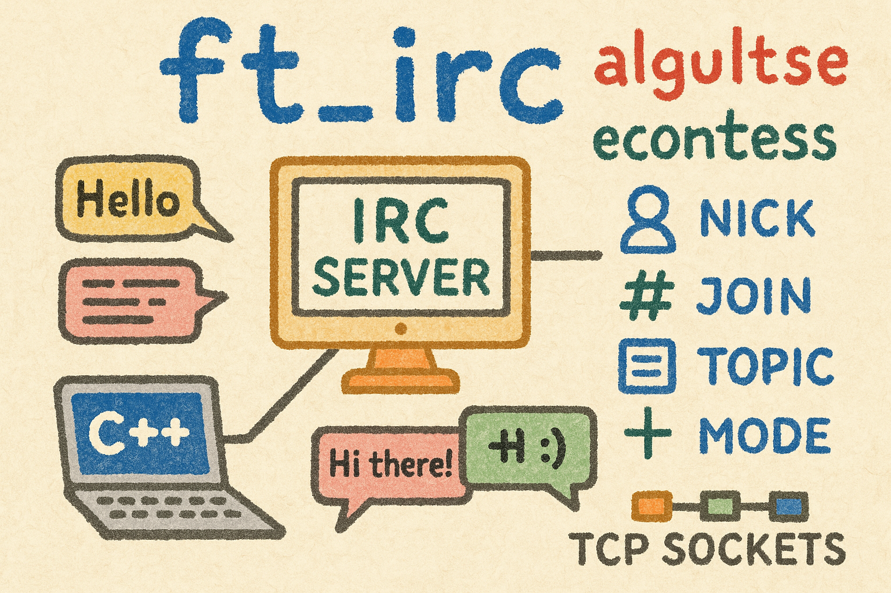

|          Grade           |                           |
|:------------------------:|:-------------------------:|
|  |  |

<br>

---

<details>
<summary>🇫🇷 FRENCH VERSION</summary>

<p align="center">
	Ceci est un <a href="./subject/ft_irc.fr.subject.pdf">projet</a> de l'école 42 (réalisé en février 2025).
</p>

## Preamble
L’objectif du projet est de coder un serveur IRC (Internet Relay Chat) conforme au protocole [RFC 2812](https://www.rfc-editor.org/rfc/rfc2812.html).  
Le serveur est codé en C++98 et permet à plusieurs clients de se connecter, d’échanger des messages privés ou en groupe, de rejoindre des canaux et d’utiliser des commandes IRC courantes.

## Compétences:
- Programmation réseau bas niveau avec `sockets TCP`
- Communication `non-bloquante` avec `poll()`
- Gestion des utilisateurs et des canaux IRC
- Implémentation des [commandes IRC](./include/cmds) (de classes séparée) : `NICK`, `USER`, `JOIN`, `PRIVMSG`, `KICK`, `INVITE`, `TOPIC`, `MODE`, etc.
- L’`architecture du système` repose sur des `classes distinctes` : Client, Server, Channel

## Installation
```bash
git clone https://github.com/N0fish/ft_irc.git
cd ft_irc
```

## Lancement
```bash
make
./ircserv <port> <password>
Ex: ./ircserv 6667 1234
```

## error checking
```bash
valgrind --track-origins=yes --leak-check=full --show-leak-kinds=all ./ircserv 6667 1234
```

## another terminal
```bash
nc 127.0.0.1 6667
```

## irssi linux
```bash
/connect localhost 6667 1234
```

</details>

---

<details>
<summary>🇬🇧 ENGLISH VERSION</summary>

<p align="center">
    This is a <a href="./subject/ft_irc.en.subject.pdf">project</a> from 42 School (completed in february 2025).
</p>

## Preamble
The goal of this project is to implement an IRC (Internet Relay Chat) server based on the [RFC 2812](https://www.rfc-editor.org/rfc/rfc2812.html) protocol.
The server is written in C++98 and supports multiple clients connecting, sending private or group messages, joining channels, and using standard IRC commands.

## Skills:
- Low-level network programming using `TCP sockets`
- `Non-blocking` I/O with `poll()`
- User and channel management
- Implementation of [IRC commands](./include/cmds) (an individual classes): NICK, USER, JOIN, PRIVMSG, KICK, INVITE, TOPIC, MODE, etc.
- The `system architecture` is built around `separate classes`: Client, Server, Channel

## Installation
```bash
git clone https://github.com/N0fish/ft_irc.git
cd ft_irc
```

## Launch
```bash
make
./ircserv <port> <password>
Ex: ./ircserv 6667 1234
```

## error checking
```bash
valgrind --track-origins=yes --leak-check=full --show-leak-kinds=all ./ircserv 6667 1234
```

## another terminal
```bash
nc 127.0.0.1 6667
```

## irssi linux
```bash
/connect localhost 6667 1234
```

</details>

---

<details>
<summary>🇷🇺 RUSSIAN VERSION</summary>

<p align="center">
    Это <a href="./subject/ft_irc.en.subject.pdf">проект</a> из школы 42 (выполнен в феврале 2025 года).
</p>

## Преамбула
Цель проекта — реализовать IRC (Internet Relay Chat) сервер в соответствии со стандартом [RFC 2812](https://www.rfc-editor.org/rfc/rfc2812.html).
Сервер написан на C++98 и позволяет нескольким клиентам подключаться, отправлять личные и групповые сообщения, подключаться к каналам и использовать стандартные команды IRC.

## Навыки:
- Низкоуровневое сетевое программирование с использованием `TCP-сокетов`
- `Неблокирующий` ввод-вывод с использованием `poll()`
- Управление пользователями и каналами
- Реализация [IRC-команд](./include/cmds) (как отдельные классы): NICK, USER, JOIN, PRIVMSG, KICK, INVITE, TOPIC, MODE и др.
- `Архитектура системы` построена на `отдельных классах`: Client, Server, Channel

## Установка
```bash
git clone https://github.com/N0fish/ft_irc.git
cd ft_irc
```

## Запуск
```bash
make
./ircserv <port> <password>
Ex: ./ircserv 6667 1234
```

## error checking
```bash
valgrind --track-origins=yes --leak-check=full --show-leak-kinds=all ./ircserv 6667 1234
```

## another terminal
```bash
nc 127.0.0.1 6667
```

## irssi linux
```bash
/connect localhost 6667 1234
```

</details>

---

<br>